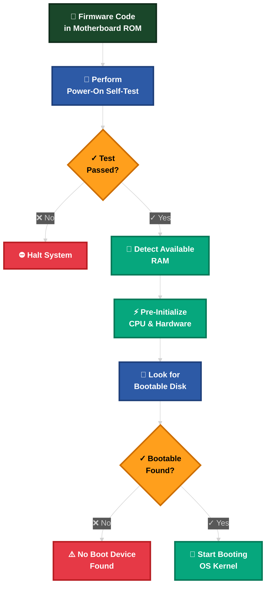
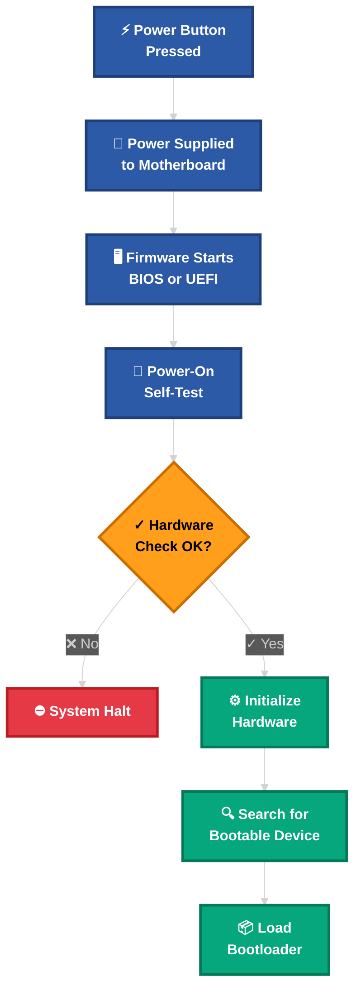

When starting an OS project, the first hurdle is breaking free from the existing operating system. By default, Rust programs link against `std`, which relies on an operating system for threads, files, networking, io streams, and memory allocation. But when you *are* making the operating system, you can't rely on these features.

This post walks through the initial setup of `boot-me-maybe-os` as a freestanding Rust binary.

## Part 1: Disabling the Standard Library

To run on bare metal, we need to disable the standard library. This is done by adding the `#![no_std]` attribute:

```rust
// Removing the use of std rust library for creating a freestanding rust binary
// This binary doesn't use any of the operating system functionalities
#![no_std]
```

## The Panic Handler

The standard library provides a panic handler that prints a message to standard output. Without `std`, we must define our own. For `boot-me-maybe-os`, we want a minimal panic handler that simply loops forever:

```rust
use core::panic::PanicInfo;

// Creating a panic handler, since we are not using the std library
#[panic_handler]
fn panic(_info: &PanicInfo) -> ! {
    loop {}
}
```

Since we don't have an OS to return to, the panic handler is a diverging function (returns `!`), meaning it never returns.

## Stack Unwinding

By default, when a Rust program panics, it initiates a process called **stack unwinding**. This process walks back up the stack, cleaning up data and running destructors for every object in scope. This ensures that resources (like open files or memory allocations) are properly released even during a crash.

However, stack unwinding is complex and requires significant runtime support (often provided by `libunwind` or similar libraries). In this initial phase, let's omit stack unwinding to keep the kernel footprint minimal. Feel free to implement this yourself, for the first iteration we will be focusing on the core functionality first.

For our OS kernel, if a panic occurs, there is no "higher authority" to catch it or clean up after it—the system is effectively dead. Therefore, the simplest and most robust approach is to **abort** immediately.

We can disable unwinding by setting `panic = "abort"` in our `Cargo.toml`. This tells the compiler to simply generate a "trap" instruction (like a breakpoint or infinite loop) on panic, drastically reducing the binary size and removing the need for unwinding infrastructure.

```toml
[profile.dev]
panic = "abort" # disable stack unwinding on panic

[profile.release]
panic = "abort" # disable stack unwinding on panic
```

## The Entry Point

In a standard Rust application, `fn main()` isn't actually the first thing the computer runs. There is a hidden "preparation" phase handled by a piece of software called `crt0` (C Runtime Zero).

When you move to a freestanding environment (like writing an OS kernel or firmware for a bare-metal microcontroller), you are essentially telling the compiler: "I'm taking over. Don't assume there is an operating system, a filesystem, or a pre-configured environment."

### 1. The Standard Flow (Hosted Environment)
In a typical Windows, macOS, or Linux environment, the execution flow looks like this:

1. **The OS Loader**: Loads your compiled binary into memory.
2. **`crt0` (The C Runtime)**: This is the "pre-game" setup. It:
    - Initializes the stack.
    - Places arguments (`argc`, `argv`) into the correct registers.
        - `argc` (Argument Count): An integer representing the number of arguments passed (e.g., 3).
        - `argv` (Argument Vector): A pointer to an array of strings (the actual arguments, like ["./my_program", "arg1", "arg2"]).
    - Sets up the C Library (e.g., glibc).
3. **Rust Runtime Entry**: The Rust standard library has its own entry point that handles panic hooks and stack overflow guards.
4. **`fn main()`**: Your code finally runs.

### 2. The Freestanding Flow (Bare Metal)
In a freestanding binary, you use `#![no_std]` and `#![no_main]`. Since there is no `crt0`, the hardware (CPU/BIOS/UEFI) jumps directly to a specific memory address where it expects your code to be.

#### Key Missing Components
Because you lack the C runtime, you lose several "comforts" we usually take for granted:

| Feature | Standard Rust | Freestanding Rust |
| :--- | :--- | :--- |
| **Memory** | `Box`, `Vec`, `String` (Dynamic allocation) | Only Stack (unless you write an Allocator) |
| **Output** | `println!` | Must write to serial ports or VGA buffer |
| **Threads** | `std::thread` | Must implement a scheduler manually |
| **Panic** | Unwinds stack and prints error | You must define a `#[panic_handler]` |

### 3. Why we use `_start`
Since the linker (the tool that stitches your code together) can no longer find the standard entry point, we have to define our own. By convention, this is named `_start`.

```rust
#![no_main]

// ...

#[unsafe(no_mangle)]
pub extern "C" fn _start() -> ! {
    // The CPU starts here.
    // We must initialize everything ourselves.
    loop {}
}
```

- `#[no_mangle]`: Tells the Rust compiler not to change the name of the function to something like `_ZN3app6_startE...`. The hardware/linker needs to see the exact name `_start`.
- `extern "C"`: Tells the compiler to use the C calling convention. This ensures that the way parameters are passed (via registers vs. stack) matches what the hardware expects.
- `-> !`: This is the "Never" type. Since there is no OS to return to, this function must never exit. If it did, the CPU would simply keep executing whatever random data happens to be next in memory.

### What happens if you use `std`?
If you try to compile a standard program for a freestanding target (like an ARM Cortex-M or x86_64 bare-metal), the compiler will throw errors because it cannot find the system libraries for things like file I/O or threading.

## Target Configuration

When you build a binary, you are not just compiling “Rust code.”
You are producing a machine-specific executable artifact that must match:
- A specific CPU architecture
- A specific operating system
- A specific ABI (Application Binary Interface)
- A specific C runtime / linking environment

Normally, when you run cargo build, Rust looks at your computer (e.g., `Windows x86_64`) and builds for that. For an OS project, you are cross-compiling—writing code on your PC to run on a completely different CPU architecture.
Since we are cross-compiling: writing code on your PC to run on a completely different architecture with zero OS support.
To achieve this, we define a Freestanding Target in .cargo/config.toml:

```toml title="config.toml"
[build]
target = "thumbv7em-none-eabihf"
```

We will discuss this in depth later.

### Detailed Firmware Execution


When you turn on a computer, it begins executing firmware code that is stored in motherboard ROM. This code performs a power-on self-test, detects available RAM, and pre-initializes the CPU and hardware. Afterwards, it looks for a bootable disk and starts booting the operating system kernel.

When we turn on a computer, the machine undergoes a critical initialization phase known as the **Power-On Self-Test (POST)**
**Power-On Self-Test (POST)** checks the following:
- CPU basic functionality
- RAM presence
- GPU
- Keyboard controller
- Essential peripherals

## The Boot Process


When power is first applied, the firmware (BIOS or UEFI) wakes up and verifies that the hardware components—such as the CPU, RAM, and peripherals—are functioning correctly. If any critical component fails, the system halts. If the checks pass, the firmware then looks for a bootable device (like a hard drive or USB) to load the bootloader from.

To visualize how we get to our `_start` function, here is a simplified view of the boot process:



## Conclusion

With these pieces in place—`no_std`, a custom panic handler, strictly defined entry point, and the correct target—`boot-me-maybe-os` can now be built as a standalone binary ready for bare-metal execution. The next steps will involve interacting with hardware and getting something to appear on the screen!
