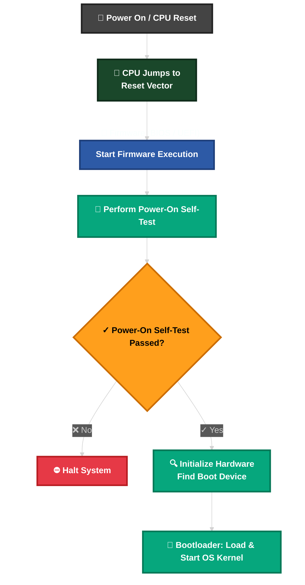
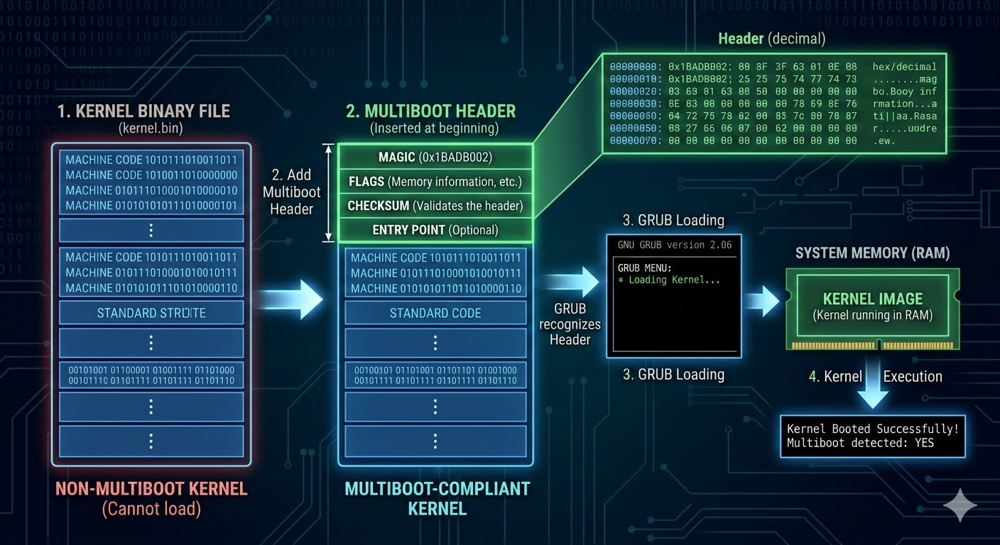
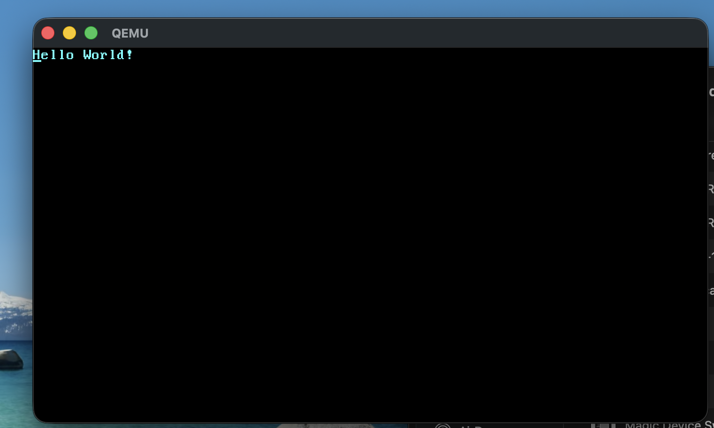

When starting an OS project, the first hurdle is breaking free from the existing operating system. By default, Rust programs link against `std`, which relies on an operating system for threads, files, networking, io streams, and memory allocation. But when you *are* making the operating system, you can't rely on these features.

This post walks through the initial setup of `boot-me-maybe-os` as a freestanding Rust binary.

## Part 1: Disabling the Standard Library

To run on bare metal, we need to disable the standard library. This is done by adding the `#![no_std]` attribute:

```rust
// Removing the use of std rust library for creating a freestanding rust binary
// This binary doesn't use any of the operating system functionalities
#![no_std]
```

## The Panic Handler

The standard library provides a panic handler that prints a message to standard output. Without `std`, we must define our own. For `boot-me-maybe-os`, we want a minimal panic handler that simply loops forever:

```rust
use core::panic::PanicInfo;

// Creating a panic handler, since we are not using the std library
#[panic_handler]
fn panic(_info: &PanicInfo) -> ! {
    loop {}
}
```

Since we don't have an OS to return to, the panic handler is a diverging function (returns `!`), meaning it never returns.

## Stack Unwinding

By default, when a Rust program panics, it initiates a process called **stack unwinding**. This process walks back up the stack, cleaning up data and running destructors for every object in scope. This ensures that resources (like open files or memory allocations) are properly released even during a crash.

However, stack unwinding is complex and requires significant runtime support (often provided by `libunwind` or similar libraries). In this initial phase, let's omit stack unwinding to keep the kernel footprint minimal. Feel free to implement this yourself, for the first iteration we will be focusing on the core functionality first.

For our OS kernel, if a panic occurs, there is no "higher authority" to catch it or clean up after it—the system is effectively dead. Therefore, the simplest and most robust approach is to **abort** immediately.

We can disable unwinding by setting `panic = "abort"` in our `Cargo.toml`. This tells the compiler to simply generate a "trap" instruction (like a breakpoint or infinite loop) on panic, drastically reducing the binary size and removing the need for unwinding infrastructure.

```toml
[profile.dev]
panic = "abort" # disable stack unwinding on panic

[profile.release]
panic = "abort" # disable stack unwinding on panic
```

## The Entry Point

In a standard Rust application, `fn main()` isn't actually the first thing the computer runs. There is a hidden "preparation" phase handled by a piece of software called `crt0` (C Runtime Zero).

When you move to a freestanding environment (like writing an OS kernel or firmware for a bare-metal microcontroller), you are essentially telling the compiler: "I'm taking over. Don't assume there is an operating system, a filesystem, or a pre-configured environment."

### 1. The Standard Flow (Hosted Environment)
In a typical Windows, macOS, or Linux environment, the execution flow looks like this:

1. **The OS Loader**: Loads your compiled binary into memory.
2. **`crt0` (The C Runtime)**: This is the "pre-game" setup. It:
    - Initializes the stack.
    - Places arguments (`argc`, `argv`) into the correct registers.
        - `argc` (Argument Count): An integer representing the number of arguments passed (e.g., 3).
        - `argv` (Argument Vector): A pointer to an array of strings (the actual arguments, like ["./my_program", "arg1", "arg2"]).
    - Sets up the C Library (e.g., glibc).
3. **Rust Runtime Entry**: The Rust standard library has its own entry point that handles panic hooks and stack overflow guards.
4. **`fn main()`**: Your code finally runs.

### 2. The Freestanding Flow (Bare Metal)
In a freestanding binary, you use `#![no_std]` and `#![no_main]`. Since there is no `crt0`, the hardware (CPU/BIOS/UEFI) jumps directly to a specific memory address where it expects your code to be.

#### Key Missing Components
Because you lack the C runtime, you lose several "comforts" we usually take for granted:

| Feature | Standard Rust | Freestanding Rust |
| :--- | :--- | :--- |
| **Memory** | `Box`, `Vec`, `String` (Dynamic allocation) | Only Stack (unless you write an Allocator) |
| **Output** | `println!` | Must write to serial ports or VGA buffer |
| **Threads** | `std::thread` | Must implement a scheduler manually |
| **Panic** | Unwinds stack and prints error | You must define a `#[panic_handler]` |

### 3. Why we use `_start`
Since the linker (the tool that stitches your code together) can no longer find the standard entry point, we have to define our own. By convention, this is named `_start`.

```rust
#![no_main]

// ...

#[unsafe(no_mangle)]
pub extern "C" fn _start() -> ! {
    // The CPU starts here.
    // We must initialize everything ourselves.
    loop {}
}
```

- `#[no_mangle]`: Tells the Rust compiler not to change the name of the function to something like `_ZN3app6_startE...`. The hardware/linker needs to see the exact name `_start`.
- `extern "C"`: Tells the compiler to use the C calling convention. This ensures that the way parameters are passed (via registers vs. stack) matches what the hardware expects.
- `-> !`: This is the "Never" type. Since there is no OS to return to, this function must never exit. If it did, the CPU would simply keep executing whatever random data happens to be next in memory.

### What happens if you use `std`?
If you try to compile a standard program for a freestanding target (like an ARM Cortex-M or x86_64 bare-metal), the compiler will throw errors because it cannot find the system libraries for things like file I/O or threading.

## Target Configuration

When you build a binary, you are not just compiling “Rust code.”
You are producing a machine-specific executable artifact that must match:
- A specific CPU architecture
- A specific operating system
- A specific ABI (Application Binary Interface)
- A specific C runtime / linking environment

Normally, when you run cargo build, Rust looks at your computer (e.g., `Windows x86_64`) and builds for that. For an OS project, you are cross-compiling—writing code on your PC to run on a completely different CPU architecture.
Since we are cross-compiling: writing code on your PC to run on a completely different architecture with zero OS support.
To achieve this, we define a Freestanding Target in .cargo/config.toml:

```toml title="config.toml"
[build]
target = "thumbv7em-none-eabihf"
```

We will discuss this in depth later.

### System Startup Flow


When you turn on a computer, the following steps happen in the following order:
1. **CPU resets:** All registers are set to predefined values.
2. **Read Firmware (BIOS/UEFI):** After reset, Firmware runs from motherboard ROM, the CPU immediately begins executing instructions from a fixed physical address called the reset vector.
3. Firmware Execution: It starts executing immediately.
    - One of the first things firmware does is run **Power-On Self-Test (POST)**. In which it checks:
        - CPU basic functionality
        - RAM presence
        - GPU
        - Keyboard controller
        - Essential peripherals
4. If POST succeeds → firmware continues boot process.
5. Firmware loads bootloader / OS.

## Firmware
There are two firmware standards: 
1. **“Basic Input/Output System“ (BIOS)** The BIOS standard is old and outdated, but simple and well-supported on any x86 machine since the 1980s.
2. **“Unified Extensible Firmware Interface” (UEFI)** UEFI, in contrast, is more modern and has much more features, but is more complex to set up.

## Bootloader:
Bootloader is a critical, low-level program that runs immediately upon device power-on to initialize hardware and loads the operating system (OS) or firmware into memory.
When BIOS finds a bootable device, it:
- Reads the first 512 bytes from the disk. Those 512 bytes are called **Master Boot Record (MBR)**

    **Why Only 512 Bytes?**

    Because the BIOS boot protocol is ancient.
- Loads it to memory at address `0x7C00`
- Jumps to it

Because the BIOS boot protocol is very old, it only loads these 512 bytes initially. Since this space is too small for a full bootloader, most bootloaders use multiple stages: a tiny first stage in the MBR that loads a larger second stage.

The bootloader’s responsibilities are:
- Locate the OS kernel image on disk and load it into memory.
- Switch the CPU from 16-bit real mode → 32-bit protected mode → 64-bit long mode, enabling full memory access and 64-bit registers.

    **Real Mode: (16-bit):**
    This is the legacy state the CPU enters immediately after power-on. It mimics the original Intel 8086 processor.

    - **Registers:** Limited to 16 bit registers.
    - **Memory Access:** You can only access about 1 MB of RAM.
    - **Security:** There is no memory protection. Any code can write to any part of memory, including the BIOS or other programs.

    > [!NOTE] 
    > **1MB of RAM How?**
    > 
    > The original 8086 CPU had:
    >  - 16-bit registers
    >  - But a 20-bit address bus
    >       - An address bus is the set of physical wires the CPU uses to denote a memory address to RAM.
    >
    > Why?
    > Because Intel wanted:
    > - Cheap 16-bit internal design
    > - But ability to address more than 64KB
    >
    >  A 16-bit register alone can only address:
    > - `2^16 = 65,536 bytes = 64KB`
    > - But Intel wanted:
    > - `2^20 = 1,048,576 bytes = 1MB`
    >
    > The Trick: Segmentation
    > Instead of increasing register size, they introduced:
    > - 16-bit segment register
    > - 4-bit offset register
    > 
    > And combined 2 registers (16-bit + 4-bit) to produce a 20-bit physical address.

    **Protected Mode: (32-bit):**
    In this mode, programs are isolated. The CPU enforces boundaries.
    - **Registers:** Limited to 32 bit registers.
    - **Memory Access:** You can only access about 4 GB of RAM.
    - **Security:** Introduces different hardware-enforced access levels.
    **Ring 0:** Kernel run here, has full control
    **Ring 3:** User applications run here, restricted access, can't access kernel memory, can't run privileged instructions.

    If somebody tries to write in kernel:
    - CPU immediately stops execution
    - Raises a **General Protection Fault (GPF)**
    - OS kills the process

    **Long Mode (64-bit):**  
    This is the modern 64-bit operating mode used by today’s operating systems.  
    It provides a massive virtual address space, mandatory paging, and stronger memory control.

    - **Registers:** Expanded to 64-bit registers (`RAX`, `RBX`, etc.), plus additional registers (`R8–R15`).  
    This allows direct 64-bit arithmetic and much larger integer values.

    - **Memory Access:** Theoretical limit is extremely large (2⁶⁴ bytes).  
    Practically, current CPUs use 48-bit virtual addressing (≈256 TB of virtual memory).  
    Paging is mandatory — all memory access goes through page tables.

    - **Security:** Same differen hardware-enforced access levels as protected mode.

## Our Bootloader
Multiboot is a standard protocol that acts as a universal "handshake" between a bootloader (like GRUB) and your operating system kernel.

To avoid every operating system implementing its own custom bootloader, the Free Software Foundation introduced the Multiboot standard in 1995. It defines a common interface between the bootloader and the kernel, allowing any Multiboot-compliant bootloader to load any compliant OS. The reference implementation is GNU GRUB, the widely used Linux bootloader.

Making a kernel Multiboot-compliant is relatively simple — you only need to add a special Multiboot header at the beginning of the kernel binary. This allows GRUB to recognize and load it.


However, Multiboot and GRUB have some practical drawbacks:

- They support only the 32-bit protected mode. This means that you still have to do the CPU configuration to switch to the 64-bit long mode.
- They are designed to make the bootloader simple instead of the kernel. For example, the kernel needs to be linked with an adjusted default page size, because GRUB can’t find the Multiboot header otherwise. Another example is that the boot information, which is passed to the kernel, contains lots of architecture-dependent structures instead of providing clean abstractions.
- Both GRUB and the Multiboot standard are only sparsely documented.
- GRUB needs to be installed on the host system to create a bootable disk image from the kernel file. This makes development on Windows or Mac more difficult.

Because of these limitations, we are choosing not to rely on GRUB or the Multiboot standard for this project. Instead, we'll be using a custom boot approach tailored for a 64-bit Rust kernel, keeping the early boot process minimal and under full control.

## A minimum Kernel
Now that we roughly know how a computer boots, it’s time to create our own minimal kernel. Our goal is to create a disk image that prints a “Hello World!” to the screen when booted. We do this by extending the previous post’s freestanding Rust binary.

## Target Specification
Continuing from the concept of target triples, for our use case we were using `target = "thumbv7em-none-eabihf"` to define our target.
Since we are doing OS development where we our target machine is bare metal hardware. We have to define our own Custom Target Specification as per our own needs.

### The Anatomy of a Target JSON

A target specification file tells the Rust compiler exactly how to handle code generation and linking without relying on a host operating system. For an x86_64 system, the configuration might look like this:
```json
{
    "llvm-target": "x86_64-unknown-none",
    "data-layout": "e-m:e-p270:32:32-p271:32:32-p272:64:64-i64:64-i128:128-f80:128-n8:16:32:64-S128",
    "arch": "x86_64",
    "target-endian": "little",
    "target-pointer-width": "64",
    "target-c-int-width": "32",
    "os": "none",
    "executables": true,
    "linker-flavor": "ld.lld",
    "linker": "rust-lld",
    "panic-strategy": "abort",
    "disable-redzone": true,
    "features": "-mmx,-sse,+soft-float",
    "rustc-abi": "x86-softfloat"
}
```

### Key Configuration Fields

When you move away from a standard target like `x86_64-unknown-linux-gnu`, these specific fields become critical:

- **os: "none":** This is the "freestanding" flag. It tells Rust not to assume the existence of a kernel, a file system, or network stacks.
- **linker-flavor: "ld.lld":** Instead of using the system's default C linker (which might try to include default Linux/Windows libraries), we use the LLVM linker provided with Rust.
- **panic-strategy: "abort":** Since we don't have an OS to handle stack unwinding (the process of cleaning up memory after a crash), we simply tell the CPU to stop or "abort."
- **disable-redzone:** A specific requirement for kernel-level programming. In x86_64, the "redzone" is an optimization that allows functions to use a small area below their stack pointer. If an interrupt occurs, this area could be overwritten, causing a catastrophic kernel crash.
- **features:** Here we enable or disable CPU features. For example, +soft-float tells Rust to emulate floating-point math in software because our kernel hasn't initialized the hardware's FPU (Floating Point Unit) yet.

## Printing to Screen
In x86 systems, the VGA Text Buffer is memory-mapped to the address `0xb8000`. Anything you write to that memory location is immediately rendered by the graphics hardware onto the monitor.

To understand the VGA text buffer, think of it as a long, continuous strip of memory starting at address 0xb8000. Even though we see a grid of "cells" (80x25) on the monitor, each "cell" is 2 bytes longs.
Total memory of the buffer is = 80 * 25 * 2 bytes = 4000 bytes.

Each "cell" on the screen takes up 2 bytes (16 bits) in memory:
- **The Character Byte:** The ASCII value (e.g., 'H' is 0x48).
- **The Attribute Byte:** This defines the color. The first 4 bits are the background, and the last 4 bits are the foreground (text color).

### To print "OK" to the screen
To see this in action, we can update your `_start` function. We use `unsafe` because we are dereferencing a raw pointer to a specific hardware memory address—something Rust normally prevents to keep you safe.
```rust
#[unsafe(no_mangle)]
pub extern "C" fn _start() -> ! {
    // A pointer to the VGA buffer (0xb8000)
    // We are keeping this as u8 because ideally it'll be in the range [0xb8000, 0xb8000 + 4000]
    let vga_buffer = 0xb8000 as *mut u8;

    // We use 'unsafe' because we're writing directly to a memory address
    unsafe {
        // Write 'O' (ASCII 0x4F) at the first position
        *vga_buffer.offset(0) = b'O';
        // Set color: White text (0xF) on Black background (0x0) -> 0x0F
        *vga_buffer.offset(1) = 0x0f;

        // Write 'K' (ASCII 0x4B) at the second position (offset 2)
        *vga_buffer.offset(2) = b'K';
        // Set color: White text on Black background
        *vga_buffer.offset(3) = 0x0f;
    }

    loop {}
}
```

## Running the Kernel
To turn our compiled kernel into a bootable disk image, we need to link it with a bootloader. The bootloader is responsible for initializing the CPU and loading our kernel.
Instead of writing our own bootloader, which is a project on its own, we use the bootloader crate. This crate implements a basic BIOS bootloader without any C dependencies, just Rust and inline assembly. To use it for booting our kernel, we need to add a dependency on it:

```toml title="Cargo.toml"

[dependencies]
bootloader = "0.9"
```

### How does it work?

The bootimage tool performs the following steps behind the scenes:

- **Compiling the Kernel to an ELF File:** The kernel is the core of your operating system. Because it doesn't run inside another OS (like Windows or Linux), it can't be a standard `.exe` or typical binary.
    - **The Process:** The compiler takes your source code and translates it into machine code.
    - **The Format:** It saves this code as an ELF (Executable and Linkable Format) file.
    - **Why ELF?** ELF files contain more than just code; they include "headers" that tell the bootloader where the code should be loaded into memory and where the entry point (the first instruction) is located.
- **Compiling the Bootloader:** The bootloader is a small program that runs before the kernel. It's a separate program written to run in Real Mode (the 16-bit limited state the CPU starts in).
It's responsible for initializing the CPU and loading the kernel into memory.
- **Linking the Kernel and Bootloader:** This is where the magic happens. The bootimage tool takes the raw bytes of your Kernel ELF and "embeds" them into the bootloader binary.

For this we are using an external tool called [`bootimage`](https://github.com/rust-osdev/bootimage).

Install `bootimage` using cargo:
````bash
cargo install bootimage
````

Create a `bootimage` using:
```bash
cargo bootimage
```

### QEMU

To run this kernel, we need to use QEMU, it's an open-source machine emulator and virtualizer. It lets you run an entire computer system inside another computer.
- **Emulation:** QEMU can simulate a different CPU architecture.
- **Virtualization:** QEMU can run a virtual machine.

    QEMU simulates full hardware:
    - CPU
    - RAM
    - disk
    - BIOS / firmware
    - VGA display

To run the kernel in QEMU, we need to add the following to `.cargo/config.toml`:

``` toml title=".cargo/config.toml"
[target.'cfg(target_os = "none")']
runner = "bootimage runner"
```

And finally, we can run the kernel in QEMU using:
```bash
cargo run
```



## Conclusion

With these pieces in place—`no_std`, a custom panic handler, strictly defined entry point, and the correct target—`boot-me-maybe-os` can now be built as a standalone binary ready for bare-metal execution. The next steps will involve interacting with hardware and getting something to appear on the screen!
